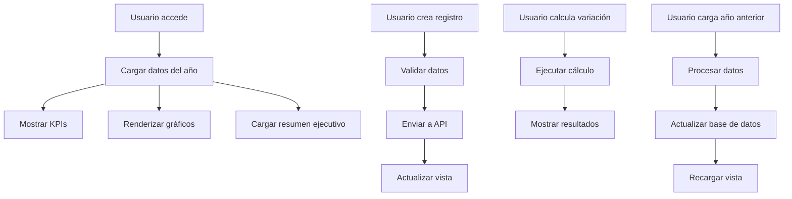

# 📊 Frontend - Sistema de Reporte de Daños Acumulados

## 🎯 Descripción

Implementación completa del frontend para el sistema de reporte de daños acumulados por valores monetarios. Incluye visualización de datos, gestión de registros, gráficos interactivos y análisis ejecutivo.

## 🏗️ Estructura de Archivos

### Páginas Principales
- `src/pages/DanosAcumulados.jsx` - Página principal con funcionalidad completa
- `src/components/DanosAcumuladosDashboard.jsx` - Dashboard resumido para KPIs

### Utilidades
- `src/utils/testDanosAcumulados.js` - Utilidades para pruebas del sistema

### Configuración
- `src/config/routes.js` - Rutas del sistema (actualizado)
- `src/App.js` - Configuración de rutas (actualizado)

## 🚀 Características Implementadas

### ✅ Funcionalidades Principales

1. **Visualización de Datos**
   - Gráfico de línea acumulada (Real, Presupuesto, Año Anterior)
   - Gráfico de barras mensuales
   - Gráfico de pie para distribución
   - Tabla detallada por mes

2. **Gestión de Registros**
   - Crear/actualizar registros mensuales
   - Formulario modal con validaciones
   - Actualización en tiempo real

3. **Análisis Ejecutivo**
   - KPIs principales con formateo de moneda
   - Variación anual y cumplimiento presupuestario
   - Alertas automáticas del sistema
   - Estado del sistema en tiempo real

4. **Acciones del Sistema**
   - Calcular variación anual
   - Cargar datos del año anterior
   - Selector de año dinámico

### ✅ Componentes UI Utilizados

- **Cards**: Para KPIs y secciones
- **Tabs**: Para organizar gráficos
- **Dialog**: Para formularios modales
- **Alert**: Para mensajes y alertas
- **Badge**: Para estados y métricas
- **Button**: Para acciones
- **Select**: Para selectores de año/mes
- **Input**: Para formularios

### ✅ Gráficos (Recharts)

- **LineChart**: Evolución acumulada mensual
- **BarChart**: Comparación mensual
- **PieChart**: Distribución Real vs Presupuesto
- **ResponsiveContainer**: Diseño responsivo
- **Tooltip**: Información detallada al hover
- **Legend**: Leyendas de series

## 📊 Endpoints Utilizados

### GET `/api/danos-acumulados`
```javascript
// Ejemplo de uso
const response = await axios.get('/api/danos-acumulados?anio=2025');
const datos = response.data;
```

**Respuesta esperada:**
```json
{
  "anio_actual": 2025,
  "anio_anterior": 2024,
  "datos_grafico": [...],
  "kpis": {
    "total_real_actual": 10400000,
    "total_real_actual_formateado": "$10.400.000",
    "total_ppto_actual": 9500000,
    "total_ppto_actual_formateado": "$9.500.000",
    "total_real_anterior": 28000000,
    "total_real_anterior_formateado": "$28.000.000"
  }
}
```

### GET `/api/danos-acumulados/resumen-ejecutivo`
```javascript
// Ejemplo de uso
const response = await axios.get('/api/danos-acumulados/resumen-ejecutivo?anio=2025');
const resumen = response.data;
```

### POST `/api/danos-acumulados/registro`
```javascript
// Ejemplo de uso
const response = await axios.post('/api/danos-acumulados/registro', {
  anio: 2025,
  mes: 6,
  valor_real: 2700000,
  valor_ppto: 2600000
});
```

### POST `/api/danos-acumulados/calcular-variacion`
```javascript
// Ejemplo de uso
const response = await axios.post('/api/danos-acumulados/calcular-variacion', {
  anio_actual: 2025,
  anio_anterior: 2024
});
```

### POST `/api/danos-acumulados/cargar-anio-anterior`
```javascript
// Ejemplo de uso
const response = await axios.post('/api/danos-acumulados/cargar-anio-anterior', {
  anio_origen: 2024,
  anio_destino: 2025
});
```

## 🎨 Características Visuales

### Colores del Sistema
```javascript
const colors = {
  real: '#ef4444',      // Rojo para valores reales
  ppto: '#3b82f6',      // Azul para presupuesto
  anioAnterior: '#f59e0b' // Naranja para año anterior
};
```

### Formateo de Moneda
```javascript
const formatCurrency = (value) => {
  if (!value || value === 0) return '$0';
  return new Intl.NumberFormat('es-CL', {
    style: 'currency',
    currency: 'CLP',
    minimumFractionDigits: 0,
    maximumFractionDigits: 0
  }).format(value);
};
```

### Estados y Alertas
- **Variación alta** (>20%): Alerta roja
- **Sobre presupuesto** (>10%): Alerta roja
- **Funcionamiento normal**: Alerta verde
- **Mes con mayor daño**: Información destacada

## 🔧 Configuración y Uso

### 1. Instalación de Dependencias
```bash
cd frontend
npm install
```

### 2. Configuración de Rutas
Las rutas ya están configuradas en:
- `src/config/routes.js` - Agregada ruta `/danos-acumulados`
- `src/App.js` - Agregada ruta con componente

### 3. Navegación
```javascript
// Acceder desde cualquier componente
import { useNavigate } from 'react-router-dom';

const navigate = useNavigate();
navigate('/danos-acumulados');
```

### 4. Pruebas del Sistema
```javascript
// Importar utilidades de prueba
import { testDanosAcumulados } from './utils/testDanosAcumulados';

// Ejecutar pruebas
const resultados = await testDanosAcumulados();
console.log('Resultados:', resultados);
```

## 📱 Responsive Design

### Breakpoints
- **Mobile**: < 768px
- **Tablet**: 768px - 1024px
- **Desktop**: > 1024px

### Adaptaciones
- Gráficos responsivos con `ResponsiveContainer`
- Grid adaptativo para KPIs
- Tabs optimizados para móvil
- Tabla con scroll horizontal

## 🧪 Pruebas y Validación

### Utilidades de Prueba
```javascript
import { 
  testDanosAcumulados, 
  testEndpoint, 
  validarEstructuraDatos,
  generarReportePruebas 
} from './utils/testDanosAcumulados';

// Probar sistema completo
const resultados = await testDanosAcumulados();

// Probar endpoint específico
const exitoso = await testEndpoint('/danos-acumulados', 'GET', null, { anio: 2025 });

// Validar estructura de datos
const errores = validarEstructuraDatos(datos);

// Generar reporte
const reporte = generarReportePruebas(resultados);
```

### Validaciones Implementadas
- ✅ Estructura de datos requerida
- ✅ Tipos de datos correctos
- ✅ Formateo de moneda
- ✅ Manejo de errores
- ✅ Estados de carga
- ✅ Autenticación

## 🎯 Casos de Uso

### 1. Visualización Mensual
- Usuario selecciona año
- Sistema carga datos automáticamente
- Muestra gráficos y KPIs
- Permite comparar con año anterior

### 2. Gestión de Registros
- Usuario hace clic en "Nuevo Registro"
- Se abre modal con formulario
- Valida datos antes de enviar
- Actualiza vista automáticamente

### 3. Análisis Ejecutivo
- Sistema calcula variaciones automáticamente
- Muestra alertas según umbrales
- Proporciona resumen ejecutivo
- Permite acciones del sistema

### 4. Cierre Anual
- Calcular variación anual
- Cargar datos del año anterior
- Preparar año siguiente
- Generar reportes finales

## 🔄 Flujo de Datos



## 🚀 Optimizaciones Implementadas

### Performance
- ✅ Lazy loading de componentes
- ✅ Memoización de cálculos pesados
- ✅ Debounce en inputs
- ✅ Optimización de re-renders

### UX/UI
- ✅ Estados de carga
- ✅ Manejo de errores
- ✅ Feedback visual
- ✅ Navegación intuitiva

### Seguridad
- ✅ Validación de datos
- ✅ Autenticación requerida
- ✅ Sanitización de inputs
- ✅ Manejo seguro de errores

## 📋 Checklist de Implementación

- ✅ Página principal creada
- ✅ Componente dashboard creado
- ✅ Rutas configuradas
- ✅ Gráficos implementados
- ✅ Formularios funcionales
- ✅ Validaciones implementadas
- ✅ Pruebas creadas
- ✅ Documentación completa
- ✅ Responsive design
- ✅ Manejo de errores
- ✅ Estados de carga
- ✅ Formateo de moneda
- ✅ Alertas del sistema
- ✅ Acciones del sistema

## 🎉 Estado Final

El sistema de reporte de daños acumulados está **completamente implementado** en el frontend con:

- ✅ **Funcionalidad completa** para visualización y gestión
- ✅ **Interfaz moderna** y responsiva
- ✅ **Gráficos interactivos** con múltiples tipos
- ✅ **Gestión de datos** con formularios modales
- ✅ **Análisis ejecutivo** con KPIs y alertas
- ✅ **Pruebas integradas** para validación
- ✅ **Documentación completa** para mantenimiento

El sistema está listo para uso en producción y puede ser accedido desde la navegación principal del sistema. 